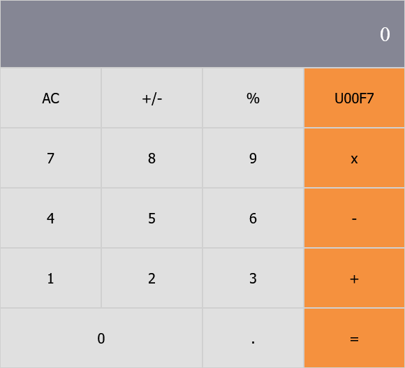

# Math Magician

> A calculator to help every aspiring Math Magician with their Math Magic.

Additional description about the project and its features.

## Built With

- Node.js
- React

<!-- ## Live Demo

[Live Demo Link](https://livedemo.com) -->

## Getting Started

To get a local copy up and running follow these simple example steps.

### Prerequisites
- Node.js

### Setup
- Clone this repository.
- `cd` into the directory.

### Install
- Enter `npm install` in the terminal.
- Then enter `npm run build`.
- Open `index.html` in the `build` directory.
- Enjoy!

<!-- ### Usage

### Run tests

### Deployment -->

## Authors

👤 **Humaira Zaman**

- GitHub: [@qwibbler](https://github.com/qwibbler)
- Twitter: [@hmemaz](https://twitter.com/hmemaz)
- LinkedIn: [Humaira Zaman](https://www.linkedin.com/in/hmemaz1994/)

## 🤝 Contributing

Contributions, issues, and feature requests are welcome!

Feel free to check the [issues page](../../issues/).

## Show your support

Give a ⭐️ if you like this project!

<!-- ## Acknowledgments

- Hat tip to anyone whose code was used
- Inspiration
- etc -->

## 📝 License

This project is [MIT](./MIT.md) licensed.
