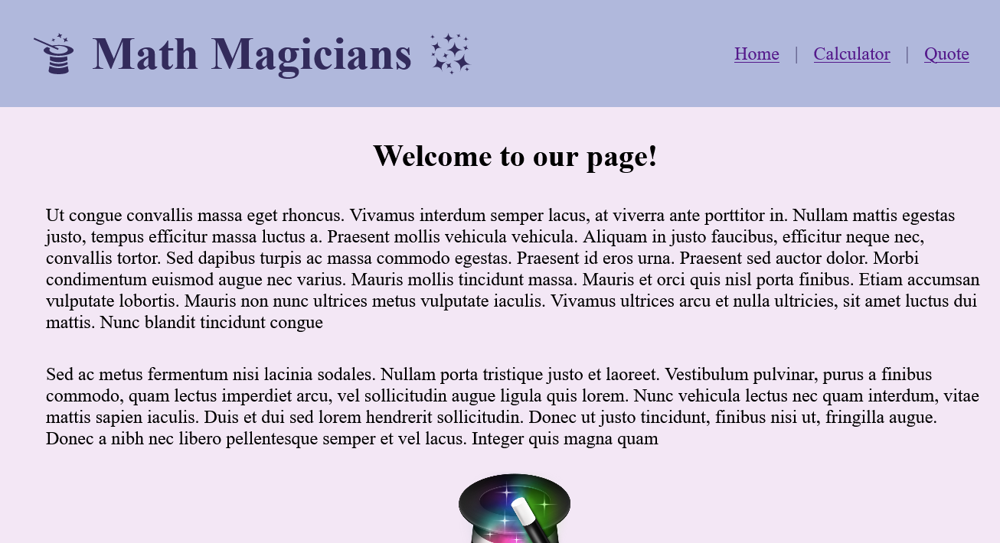
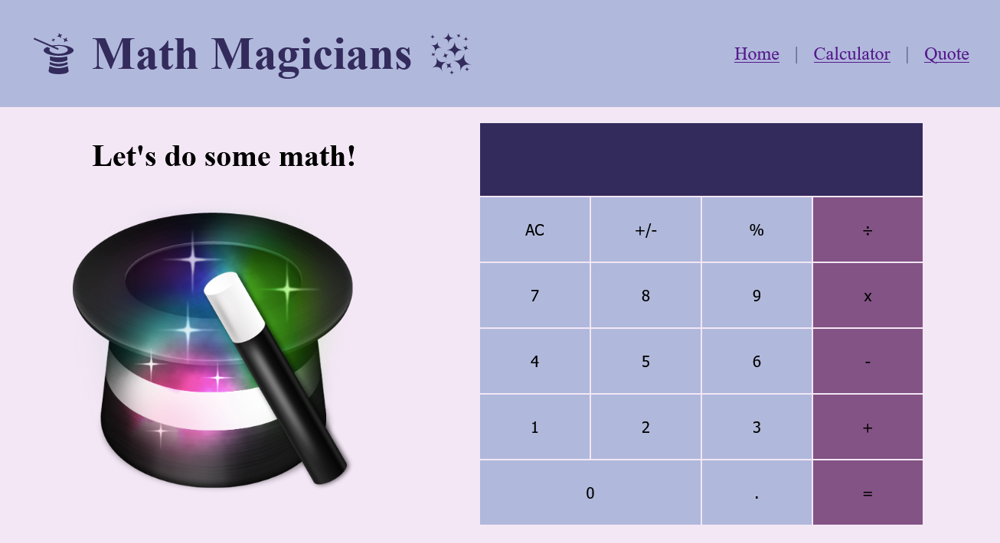
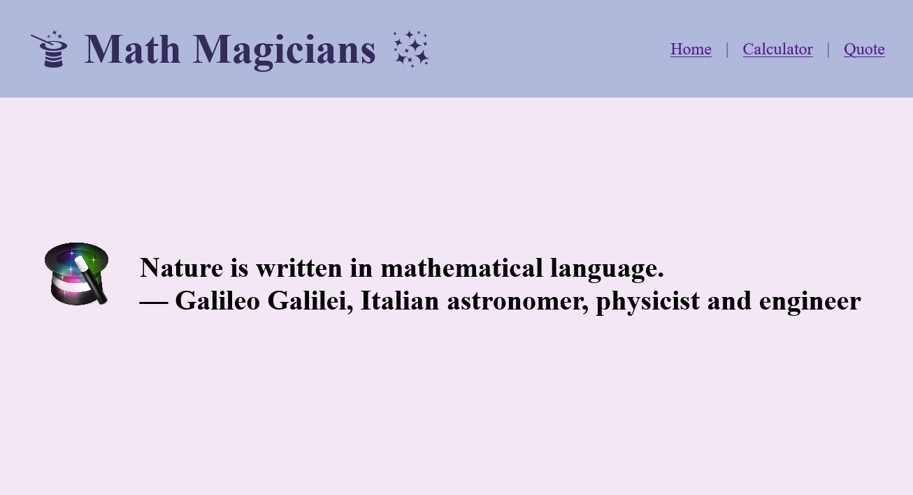

# Math Magician

> A calculator to help every aspiring Math Magician with their Math Magic.

Additional description about the project and its features.

# Live Demo
[Demo page](https://qwibbler.github.io/math-magic/)

## Built With

- Node.js
- React
- JavaScript
- Css

## Getting Started

To get a local copy up and running follow these simple example steps.

### Prerequisites
- Node.js

### Setup
- Clone this repository.
- `cd` into the directory.

### Install
- Enter `npm install` in the terminal.
- Then enter `npm run build`.
- Open `index.html` in the `build` directory.
- Enjoy!

### Usage
- Go to the ***Home*** page to *see* the magic we do.
- Go to the ***Calculator*** page to *do* the magic we do.
- Go to the ***Quote*** page to see a random math magical spell.

## Authors

👤 **Humaira Zaman**

- GitHub: [@qwibbler](https://github.com/qwibbler)
- Twitter: [@hmemaz](https://twitter.com/hmemaz)
- LinkedIn: [Humaira Zaman](https://www.linkedin.com/in/hmemaz1994/)

## 🤝 Contributing

Contributions, issues, and feature requests are welcome!

Feel free to check the [issues page](../../issues/).

## Show your support

Give a ⭐️ if you like this project!

## 📝 License

This project is [MIT](./MIT.md) licensed.
